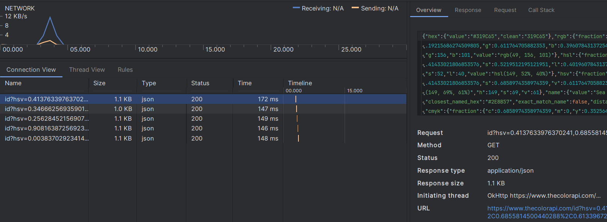
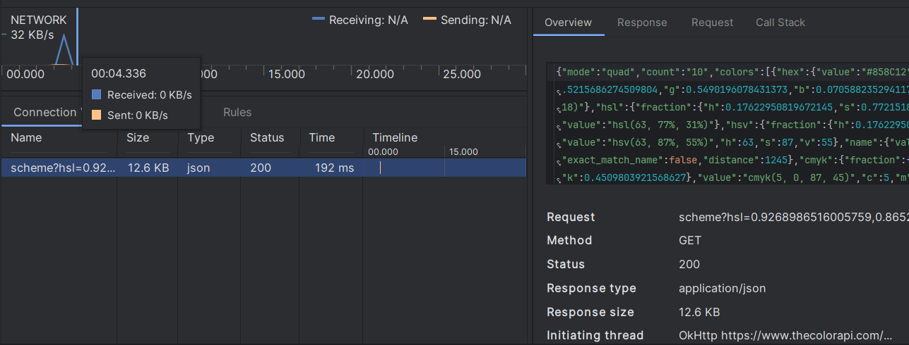

# Сравнение производительности функции получения случайных цветов

## Среднее время получения ответа примерно 750 мс в оригинальной реализации функции

## Для оптимизации используется один запрос для получения необходимого количества цветов, время сократилось до 200 мс
